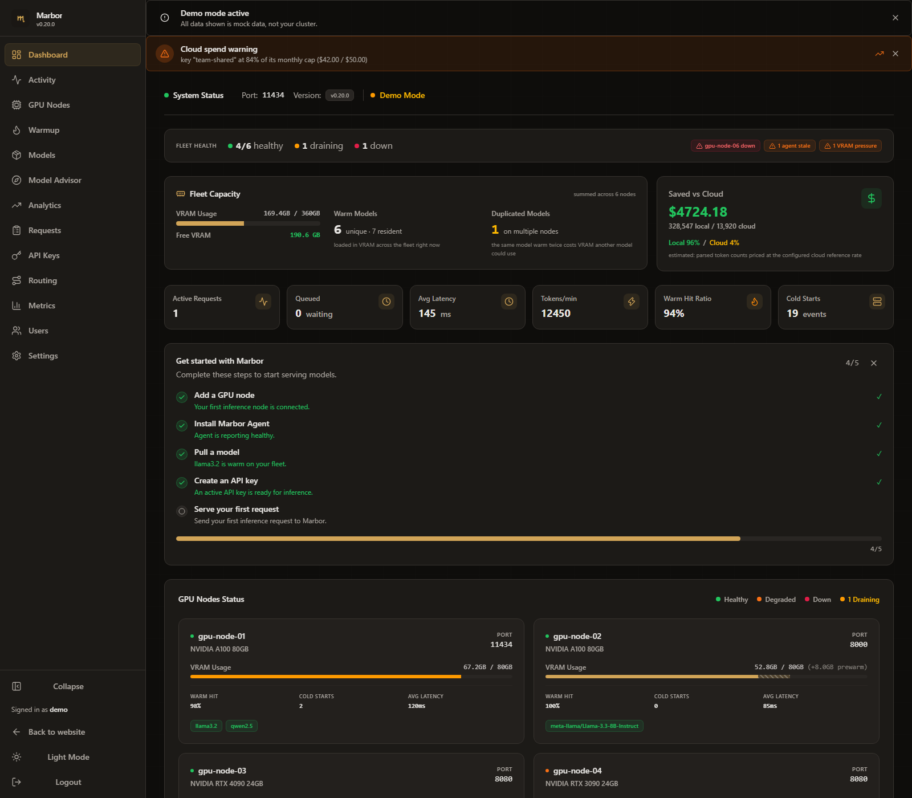

# ollama-mesh

**Enterprise-Grade, Hardware-Aware GPU Routing Control Plane and Scheduler for Ollama, vLLM, TGI, and llama.cpp**

One endpoint for all your LLM traffic. Every request routes to the GPU node that already holds the model warm in VRAM - across any OpenAI-compatible backend. Cloud overflow activates only when local capacity is exhausted - consent-first, never silent. Local hardware first. Cloud second. Full financial receipts.

[](https://github.com/Anirudhx7/ollama-mesh/actions/workflows/ci.yml)
[](https://github.com/Anirudhx7/ollama-mesh/releases/latest)
[](https://opensource.org/licenses/MIT)


*Enterprise dashboard: live request telemetry, cluster-wide VRAM utilization, per-key cost attribution, and cloud-deflection savings — all from real parsed token counts.*

---

## The Problem: Uncontrolled LLM Cloud Spend at Scale

Enterprise teams deploying LLM-powered applications — coding agents, RAG pipelines, internal copilots — face a compounding cost problem:

- **Cold-start latency tax.** Generic load balancers spray requests across GPU nodes with no awareness of model residency. Each miss triggers a 15–45 second model load from disk to VRAM, destroying time-to-first-token (TTFT) SLAs.
- **Invisible cloud egress.** Without a local-first routing layer, traffic silently overflows to OpenAI/Anthropic at $0.15–$60/M tokens. Platform teams discover the bill at month-end.
- **No GPU utilization visibility.** Ops teams have Grafana for CPU and memory. They have nothing for per-node VRAM residency, model warm state, or inference cost attribution across API keys.

**ollama-mesh eliminates all three.** It sits between your applications and your GPU fleet, routing every request to the node that already has the model loaded in VRAM. Cloud overflow is explicit, metered, and off by default. Every token is counted, attributed to an API key, and valued against your configured cloud reference rate.

---

## Core Architecture

```
Client Application (Agent / RAG / Copilot)
    │
    ▼
┌───────────────────────────────────────────────────────┐
│  ollama-mesh endpoint (:11434)                        │
│                                                       │
│  Auth ─► Rate Limit ─► Quota Check ─► Model Allow     │
│    │                                                  │
│    ▼                                                  │
│  Request Queue (configurable depth + backpressure)    │
│    │                                                  │
│    ▼                                                  │
│  Router: extract model from JSON body                 │
│    ├── Warm in VRAM? ──► Route to warm node           │
│    │   (least-connections among warm candidates)      │
│    ├── VRAM-fit placement ──► Node with most headroom │
│    ├── Session affinity (X-Session-ID) ──► KV-cache   │
│    └── All busy/down? ──► Cloud fallback              │
│         (OpenAI/Anthropic, format-translated)         │
│                                                       │
│  Token Tracking ─► Cost Attribution ─► Audit Log      │
└───────────────────────────────────────────────────────┘
    │               │              │
    ▼               ▼              ▼
  GPU Nodes     Cloud APIs     Prometheus :9090
  (Ollama/      (overflow)     Grafana Dashboard
   vLLM/TGI/
   llama.cpp)
```

**Single static Go binary. Zero runtime dependencies. No Python. No JVM. No Node.js.**

---

## Enterprise Feature Matrix

| Category | Feature | Detail |
|----------|---------|--------|
| **GPU-Aware Routing** | Warm-first model routing | Polls `/api/ps` on every node every 2s. Routes to the node where the model is already resident in VRAM. Eliminates cold-start latency. |
| | VRAM-fit placement | Cold requests route to the node with the most free VRAM. Prevents OOM under concurrent multi-model traffic. |
| | Session affinity (KV-cache) | `X-Session-ID` header pins a conversation to a node. KV-cache stays hot — subsequent turns skip re-prefill. TTL-based eviction. |
| | Proactive model warmup | `keep_alive` pings on a configurable schedule keep priority models resident between requests. |
| **Financial Controls** | Real-time savings tracking | Every locally-served token valued against your cloud reference rate. Dashboard shows exact dollar savings vs pure-cloud baseline. |
| | Per-key cost attribution | Token totals and estimated cost per API key per month. Attribute inference spend to teams, projects, or agents. |
| | Cloud spend metering | Overflow tokens priced at provider-configured rates. Full local-vs-cloud cost breakdown. |
| | Per-key quotas | Hard `daily_limit`/`monthly_limit` per key. 429 when exceeded. Persisted across restarts. |
| **Multi-Tenant Auth** | Per-key rate limiting | Token-bucket rate limiter per API key. `X-RateLimit-Limit/Remaining/Reset` headers on every response. |
| | Model allow-lists | Per-key model restrictions. 403 on unauthorized model access — enforced at the control plane, not advisory. |
| | Key expiration | `expires_at` per key. Automatic invalidation. No manual rotation under pressure. |
| **Observability** | Prometheus metrics | 14 production metrics: request throughput, latency percentiles, active connections, token counts, cache hit/miss, retry rates, cloud fallback frequency, quota rejections, request queue depth/timeouts, warmup pings, panic recovery, node health. |
| | Grafana dashboard | Included JSON (`grafana/ollama-mesh.json`). One-click import. VRAM utilization, request throughput, latency percentiles, cloud fallback rate. |
| | Structured logging | `--log-format json` for Loki, Datadog, Fluentd, Splunk. Per-request access log with key name, model, node, status, latency, request ID. |
| | Audit trail | Append-only JSON-lines audit log. Every request recorded with crypto/rand request IDs. |
| | Webhook alerts | `node_down`/`node_up` events with HMAC-SHA256 signatures. PagerDuty/OpsGenie/Slack-ready. |
| **Resilience** | Automatic retry/failover | Dead node before first byte triggers retry on alternate healthy nodes → cloud → 502. Transparent to the client. |
| | Request queue | Configurable `queue_max_depth` and `queue_timeout_ms`. Traffic spikes queue and drain rather than immediately 502-ing. |
| | Node drain | `POST /admin/nodes/{name}/drain` marks a node so the router skips it for new requests while in-flight work completes. Zero-downtime GPU maintenance. |
| | Peer health monitoring | Optional observability: report whether peer instances' `/health` endpoints are reachable at `/admin/ha/peers`. ollama-mesh is single-instance — there is **no** failover, shared state, or leader election. Distributing traffic across instances is an external TCP load balancer's (HAProxy/nginx) job. |
| | Config hot-reload | `SIGHUP` or `POST /admin/v1/config/reload` re-reads config in place. Key rotations and routing changes take effect without dropping connections. |
| **Cluster Telemetry** | Cluster-wide VRAM | Per-node used-VRAM live across the entire cluster from each node's own `/api/ps`. No sidecar agent required. |
| | GPU metrics | nvidia-smi integration on mesh host: temperature, power draw, total capacity. Remote nodes: operator-declared `vram_total_mb`. Every figure labelled with its source (nvidia/api/declared). |
| | VRAM fit indicators | Green/yellow/red badges per model per node. Ops teams see at a glance whether a model fits in available VRAM. |
| **Multi-Backend** | Ollama, vLLM, TGI, llama.cpp | Declare `runtime: ollama/vllm/tgi/llamacpp` per node. The router is runtime-agnostic; health probes and model-list calls use the correct API per runtime. |
| | Path-aware routing | `/api/*` routes to Ollama nodes only. `/v1/*` routes to any runtime. Non-Ollama nodes are transparent to OpenAI SDK clients. |
| **Deployment** | Single binary | One static Go binary per platform. Drop onto a VM and run. No package manager, no virtualenv, no container runtime required. |
| | Docker auto-discovery | Scans Docker socket for `ollama/ollama` containers. Auto-registers nodes. Zero config. |
| | Cloud format translation | Ollama-native requests that overflow to cloud get OpenAI responses translated back to Ollama NDJSON. Clients never see a format difference. |

---

## TTFT Performance: The Business Case

The single most impactful metric for LLM infrastructure is **Time-to-First-Token (TTFT)**. Every cold model load adds 15–45 seconds of latency before the first token appears. In a multi-agent workflow making hundreds of calls per hour, this compounds into minutes of wasted wall-clock time per pipeline execution.

ollama-mesh's warm-first routing eliminates this entirely. The router knows which models are resident in VRAM on which nodes at sub-3-second granularity. A request for `llama3.2:8b` goes to the node that already has it loaded — TTFT drops to the model's native inference speed, typically 50–200ms.

A reproducible warm-vs-cold TTFT benchmark harness is included in [`bench/`](bench/).

---

## The Savings Angle

This is the dashboard screenshot that sells itself: ollama-mesh tracks every token you served locally vs in the cloud, and shows you exactly how much that local inference saved compared to routing everything to OpenAI.

The math uses real parsed token counts from each response (`eval_count` from Ollama, `usage.total_tokens` from cloud), valued at your configured reference rate. When token data is unavailable, the dashboard shows "—" rather than a fabricated number. No fake math.

Platform engineers with a team routing through local GPU hardware typically see $200–$3,000+/month in avoided cloud spend visible in the dashboard within the first week. Full financial model: [SAVINGS-MATH.md](docs/SAVINGS-MATH.md).

---

## Supported Backends

ollama-mesh is runtime-agnostic. Declare `runtime:` per node and the router uses the correct health probe and model-discovery call for each backend.

| Backend | `runtime:` value | Health check | Model discovery | Path routing |
|---------|-----------------|--------------|-----------------|--------------|
| Ollama | `ollama` (default) | GET /api/ps | /api/ps response | /api/* and /v1/* |
| vLLM | `vllm` | GET /health | GET /v1/models | /v1/* only |
| TGI (HuggingFace) | `tgi` | GET /health | GET /info | /v1/* only |
| llama.cpp server | `llamacpp` | GET /health | GET /v1/models | /v1/* only |

`/api/*` paths (Ollama-native) route only to Ollama nodes. `/v1/*` paths route to any runtime - OpenAI SDK clients work unchanged against a mixed fleet.

**Mixed-fleet example:**

```yaml
nodes:
  - name: ollama-local
    url: http://localhost:11434
    runtime: ollama  # default
  - name: vllm-gpu
    url: http://10.0.1.20:8000
    runtime: vllm
    vram_total_mb: 81920
  - name: tgi-server
    url: http://10.0.1.21:8080
    runtime: tgi
  - name: llamacpp-server
    url: http://10.0.1.22:8080
    runtime: llamacpp
```

---

## Quick Start

**Try it with no Ollama needed:**

```bash
git clone https://github.com/Anirudhx7/ollama-mesh && cd ollama-mesh && make demo
```

`make demo` builds two mock Ollama nodes and the mesh control plane in Docker, sends 20 real HTTP requests through the endpoint, and prints the dashboard URL. Open `http://localhost:8080` with token `demo-admin-token`. Use `make demo-down` to stop.

---

**Zero-config production start (Ollama already running):**
```bash
./ollama-mesh
```
If no `config.yaml` exists, ollama-mesh auto-detects `localhost:11434`, generates API keys, and prints a curl example.

---

**Install (Linux amd64):**
```bash
curl -Lo ollama-mesh https://github.com/Anirudhx7/ollama-mesh/releases/latest/download/ollama-mesh-linux-amd64
chmod +x ollama-mesh
./ollama-mesh
```

**Supported platforms** (single static binary per target + multi-arch Docker image):

| Platform | Architecture | Asset | Typical hardware |
|----------|-------------|-------|------------------|
| Linux | amd64 | `ollama-mesh-linux-amd64` | Production GPU servers, x86 workstations |
| Linux | arm64 | `ollama-mesh-linux-arm64` | ARM servers, Graviton instances |
| macOS | Apple Silicon | `ollama-mesh-darwin-arm64` | Mac Studio, Mac Pro, M-series dev machines |
| macOS | Intel | `ollama-mesh-darwin-amd64` | Intel Macs |
| Windows | amd64 | `ollama-mesh-windows-amd64.exe` | Windows GPU workstations |
| Docker | multi-arch | `ghcr.io/anirudhx7/ollama-mesh` | Any container orchestrator |

> **macOS Gatekeeper:** binaries are not yet Apple-notarized. Clear the quarantine flag once: `xattr -d com.apple.quarantine ollama-mesh`.

All builds and `checksums.txt` on the [releases page](https://github.com/Anirudhx7/ollama-mesh/releases/latest).

**Docker Compose:**
```bash
git clone https://github.com/Anirudhx7/ollama-mesh
cd ollama-mesh
cp config.example.yaml config.yaml
docker-compose up -d
```

**Build from source:**
```bash
git clone https://github.com/Anirudhx7/ollama-mesh
cd ollama-mesh
make build
./ollama-mesh
```

Point your LLM clients at `:11434`. ollama-mesh speaks the Ollama API and passes through Ollama's OpenAI-compatible `/v1` endpoints — both `ollama` clients and OpenAI SDKs work unchanged.

**Integration guides:** [Open WebUI](docs/integrations/open-webui.md) · [Continue](docs/integrations/continue.md) · [LibreChat](docs/integrations/librechat.md) · [AWS EC2 deploy](docs/deploy/aws-ec2.md)

---

## Configuration

Start from [`config.example.yaml`](config.example.yaml):

```yaml
proxy:
  port: 11434
  log_level: info
  log_format: json  # for log aggregators

nodes:
  - name: gpu-0
    url: http://10.0.1.10:11434
    gpu_model: "NVIDIA A100 80GB"
    # runtime: ollama  # default - GET /api/ps for warm-model detection
  - name: gpu-1
    url: http://10.0.1.11:11434
    gpu_model: "NVIDIA A100 80GB"
  - name: vllm-gpu
    url: http://10.0.1.20:8000
    runtime: vllm       # GET /health + /v1/models; /v1/* traffic only
    vram_total_mb: 24576
  - name: tgi-gpu
    url: http://10.0.1.21:8080
    runtime: tgi        # GET /health + /info; /v1/* traffic only
    vram_total_mb: 24576
  - name: llamacpp-gpu
    url: http://10.0.1.22:8080
    runtime: llamacpp   # GET /health + /v1/models; /v1/* traffic only
    vram_total_mb: 16384

routing:
  strategy: warm-first
  poll_interval_ms: 2000
  fallback: least-connections
  max_retries: 2
  upstream_timeout_ms: 120000
  queue_max_depth: 100
  queue_timeout_ms: 30000
  session_affinity: true
  session_affinity_ttl: "10m"

warmup:
  enabled: true
  interval_ms: 300000
  models:
    - llama3.2:8b
    - codellama:34b

auth:
  enabled: true
  admin_token: sk-admin-change-me
  state_path: usage-state.json
  keys:
    - name: engineering
      key: sk-mesh-eng-001
      rate_limit: 5000
      monthly_limit: 5000000
      models: []
    - name: data-science
      key: sk-mesh-ds-001
      rate_limit: 2000
      daily_limit: 100000
      models:
        - llama3.2:8b
        - codellama:34b
    - name: agent-pipeline
      key: sk-mesh-agent-001
      rate_limit: 500
      monthly_limit: 2000000
      expires_at: "2027-01-01"

metrics:
  enabled: true
  port: 9090

cloud_providers:
  - name: openai-overflow
    provider: openai
    base_url: https://api.openai.com
    api_key: sk-...
    default_model: gpt-4o-mini
    cost_per_1k_tokens: 0.00015
    enabled: false  # explicit opt-in

docker:
  enabled: false
  socket: /var/run/docker.sock
  poll_interval_ms: 30000

savings:
  reference_cost_per_1k: 0.002
```

---

## How Routing Works

```
Request arrives at :11434
    │
    ▼
Auth middleware: Bearer token validation → rate limit → quota check → model allow-list
    │
    ▼
Request queue: absorbs traffic spikes (configurable depth + timeout)
    │
    ▼
Router: extract model name from JSON body
    │
    ├── X-Session-ID present + session affinity enabled?
    │   └── Yes → route to pinned node (KV-cache affinity)
    │
    ├── Model warm in VRAM on any node?
    │   └── Yes → route to warm node with least active connections
    │
    ├── All nodes healthy?
    │   └── Yes → VRAM-fit placement (most free VRAM) or least-connections fallback
    │
    └── All nodes busy/down?
        └── Cloud overflow → OpenAI/Anthropic → response format-translated → cost logged
```

The router polls `/api/ps` on each node every 2 seconds. State is real-time, not cached guesses.

**Config hot-reload:** `kill -HUP <pid>` or `POST /admin/v1/config/reload` re-reads `config.yaml` without dropping connections.

---

## Model Warmup

ollama-mesh proactively keeps priority models loaded in VRAM between requests. Without this, idle models get evicted and the next request pays the cold-start tax.

```yaml
warmup:
  enabled: true
  interval_ms: 300000   # every 5 minutes
  models:
    - llama3.2:8b       # your highest-traffic models
    - codellama:34b
```

---

## Cloud Fallback Setup

Cloud providers are used **only** when all local inference nodes (Ollama, vLLM, TGI, llama.cpp) are unavailable or at capacity. Local GPU always wins. Set `enabled: true` on any provider:

```yaml
cloud_providers:
  - name: openai-overflow
    provider: openai
    base_url: https://api.openai.com
    api_key: sk-...
    default_model: gpt-4o-mini
    cost_per_1k_tokens: 0.00015
    enabled: true
```

Ollama-native (`/api/*`) requests that fall back to cloud get the OpenAI response translated back to Ollama NDJSON — clients never see a format difference.

---

## Operational Topology

| Port | Service | Auth |
|------|---------|------|
| `:11434` | Ollama-compatible endpoint — drop-in replacement | Per-key Bearer token |
| `:8080` | Admin dashboard + REST API | Admin token |
| `:9090` | Prometheus metrics | Unauthenticated (scrape target) |

---

## Admin API

| Method | Path | Description |
|--------|------|-------------|
| GET | `/admin/v1/nodes` | Node list: status, VRAM usage, active models, source labels |
| GET | `/admin/v1/keys` | API keys: usage stats, monthly cost, token totals |
| GET | `/admin/v1/metrics/savings` | Cost savings vs pure cloud — current process lifetime |
| GET | `/admin/v1/cloud/providers` | Cloud fallback providers: status, spend |
| GET | `/health` | 200 OK when control plane is ready (unauthenticated, for LB health checks) |
| POST | `/admin/nodes/{name}/drain` | Drain node for maintenance |
| PATCH | `/admin/keys/{name}` | Mutate key rate limits, quotas, model allow-lists at runtime |
| PATCH | `/admin/nodes/{name}` | Override `vram_total_mb`, `gpu_model` at runtime |
| POST | `/admin/v1/config/reload` | Hot-reload config without SIGHUP |

---

## Observability Stack

### Prometheus

14 metrics exported at `:9090/metrics`:

- `ollamamesh_requests_total` — total proxied requests (labels: key, model, node, status)
- `ollamamesh_request_duration_seconds` — histogram of request latency
- `ollamamesh_active_connections` — active connections per node
- `ollamamesh_node_healthy` — health gauge per node (1=healthy, 0=unhealthy)
- `ollamamesh_cache_hits_total` — warm-model cache hits
- `ollamamesh_cache_misses_total` — cold-start cache misses
- `ollamamesh_tokens_total` — tokens processed (labels: key, node)
- `ollamamesh_retries_total` — upstream failover retries per node
- `ollamamesh_cloud_fallbacks_total` — cloud overflow events per provider
- `ollamamesh_quota_rejections_total` — 429 quota enforcement events (labels: key, period)
- `ollamamesh_panics_total` — recovered handler panics
- `ollamamesh_queue_depth` — current request queue depth
- `ollamamesh_queue_timeouts_total` — queued requests that timed out before getting a node
- `ollamamesh_warmup_pings_total` — proactive keepalive pings per model/node

### Grafana

Import `grafana/ollama-mesh.json` into Grafana. Point the Prometheus datasource at `:9090`. Pre-built panels: VRAM utilization, request throughput, latency percentiles, cloud fallback rate, cost attribution.

### Structured Logging

`--log-format json` emits slog JSON objects that Loki, Datadog, Fluentd, and Splunk parse natively. Every request logged with: key name (never the key value), model, target node, HTTP status, latency, request ID.

---

## Competitive Positioning

| | ollama-mesh | LiteLLM | nginx/HAProxy | Portkey/Helicone |
|---|---|---|---|---|
| **GPU-aware routing** | ✅ Polls VRAM state every 2s | ❌ Treats Ollama as a dumb URL | ❌ No GPU visibility | ❌ Cloud-only |
| **Warm-model routing** | ✅ Routes to node with model in VRAM | ❌ | ❌ | ❌ |
| **VRAM-fit placement** | ✅ Cold requests → most free VRAM | ❌ | ❌ | ❌ |
| **KV-cache session affinity** | ✅ X-Session-ID sticky routing | ❌ | ❌ | ❌ |
| **Cloud overflow (consent-first)** | ✅ Off by default, explicit opt-in | ✅ (default on) | ❌ | ✅ (cloud-native) |
| **Savings tracking** | ✅ Real parsed token math | ❌ | ❌ | Partial |
| **Per-key cost attribution** | ✅ Tokens + USD per key per month | ✅ | ❌ | ✅ |
| **Single binary, zero deps** | ✅ Go static binary | ❌ Python + deps | ✅ | ❌ SaaS |
| **Embedded dashboard** | ✅ React UI in the binary | Separate UI | ❌ | SaaS dashboard |
| **Prometheus + Grafana** | ✅ 14 metrics + included dashboard | ✅ | Partial | ❌ |
| **Local-first architecture** | ✅ GPU traffic never leaves your network | ❌ Cloud-centric | ✅ | ❌ |

### Use ollama-mesh when:

- You have on-premises GPU hardware running Ollama, vLLM, TGI, or llama.cpp and want to maximize utilization before paying for cloud tokens.
- You need per-key auth, rate limiting, cost attribution, and a usage dashboard without standing up a Python service.
- You need GPU-warm-first routing to eliminate cold-start latency in multi-agent workflows.
- You want cloud overflow that is explicitly opt-in — not a default that silently generates bills.
- You need a single static binary that ops teams can deploy and manage like any other Go service.

### Use LiteLLM instead when:

- You route primarily between cloud providers (Bedrock, Vertex, Cohere) and don't have on-premises GPU hardware.
- You are already invested in the LiteLLM ecosystem and don't need GPU-aware routing.
- You are comfortable with the Python operational footprint.

---

## Roadmap

See [ROADMAP.md](ROADMAP.md) for the full open-core strategy.

---

## Documentation

- [Production Deployment Guide](docs/PRODUCTION.md)
- [Savings Math](docs/SAVINGS-MATH.md) — how every dollar figure is computed
- [Use Cases](docs/USE-CASES.md)
- [Security](SECURITY.md)
- [Changelog](CHANGELOG.md)
- [Contributing](CONTRIBUTING.md)

---

## License

MIT
