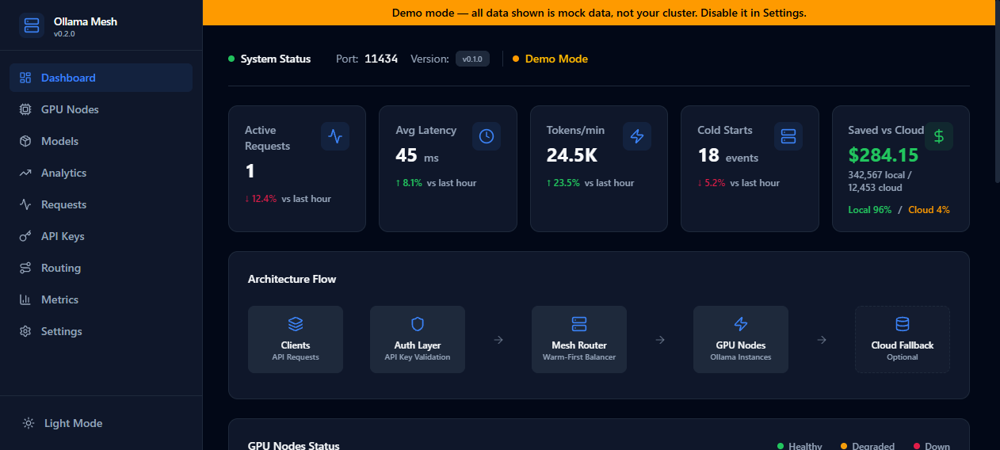

# ollama-mesh

**Zero cold starts for your Ollama fleet.** One endpoint for all your LLM traffic: every request goes to the GPU node that already holds the model warm in VRAM, with cloud overflow only when you allow it. Local first, cloud second, with receipts.

[](https://github.com/Anirudhx7/ollama-mesh/actions/workflows/ci.yml)
[](https://github.com/Anirudhx7/ollama-mesh/releases/latest)
[](https://opensource.org/licenses/MIT)


*Dashboard showing live request log with Tokens and tok/s columns, VRAM fit badges on GPU Nodes, and savings computed from real token counts.*

---

## LiteLLM treats Ollama like an API. ollama-mesh treats it like a cluster.

It polls each node's GPU state every 2 seconds and sends every request to whichever box already has the model warm in VRAM - so you stop paying the 30-second cold-start tax on each call. When the cluster is saturated or down, it overflows to OpenAI/Anthropic (off by default, consent-first). One static Go binary. No Python, no runtime.

```bash
# See it live in 60 seconds - no Ollama, no Go install, just Docker:
git clone https://github.com/Anirudhx7/ollama-mesh && cd ollama-mesh && make demo
```

> **Benchmark:** a reproducible warm-vs-cold time-to-first-token harness lives in [`bench/`](bench/). Headline numbers are measured on real GPU hardware and published as measurements, never estimates. See [CHANGELOG.md](CHANGELOG.md) for release history.

---

## What's new in v0.8

- **Model warmup** - proactive `keep_alive` pings on a configurable schedule keep your most-used models loaded in VRAM. No more cold starts on the first request after idle.
- **SIGHUP config hot-reload** - rotate API keys or change routing config without restarting. Send `kill -HUP <pid>` and the new config is live in under a second.
- **Request queue with backpressure** - configurable `queue_max_depth` and `queue_timeout_ms` prevent thundering-herd from hammering nodes. Excess requests queue and drain rather than 502-ing immediately.
- **11 Prometheus metrics** (up from 7) - retries, cloud fallbacks, quota rejections, and panic counts are now tracked.

---

## The savings angle

This is what makes the dashboard screenshot worth sharing: ollama-mesh tracks every token you served locally vs in the cloud, and shows you exactly how much that local inference saved you compared to routing everything to OpenAI.

The math uses real parsed token counts from each response (`eval_count` from Ollama, `usage.total_tokens` from cloud), valued at your configured reference rate. When token data is unavailable, the dashboard shows "—" rather than a fabricated number. No fake math.

Platform engineers with a team routing through one Ollama box typically see $200-800/month in avoided cloud spend visible in the dashboard within the first week.

---

## Why

- Your Ollama box is busy or down and requests just fail - ollama-mesh overflows them to OpenAI/Anthropic automatically, so clients never see an error
- Models cold-start on every new node - 30 second delays kill UX. Warm-first routing sends requests to the node that already has the model in VRAM
- You have no visibility into what's being served locally vs in the cloud, or what it's costing you

Works with a single Ollama node plus a cloud fallback key. Scales to multiple nodes when you add them.

---

## Who is this for?

- **Self-hosters** running apps or agents against one Ollama box: get cloud overflow, API keys, and a dashboard.
- **Platform engineers** with on-prem GPUs and a team to serve: per-key auth, rate limits, cost visibility, Prometheus/Grafana.
- **Multi-GPU homelabs**: warm-first routing across nodes, no more cold-start roulette.

Not for you if you're one person chatting with one box occasionally - you don't need a proxy.

**"Isn't this just LiteLLM?"** No - LiteLLM routes between clouds and treats Ollama as a dumb URL. ollama-mesh treats your GPU as the preferred resource and the cloud as the overflow valve, and it knows which node already has the model in VRAM. One static Go binary, no Python stack. Full comparison: [How It Compares](#how-it-compares).

Existing clients keep working: ollama-mesh speaks the Ollama API and passes through Ollama's OpenAI-compatible `/v1` endpoints, so both `ollama` clients and OpenAI SDKs can point at it unchanged.

---

## Quick Start

**Try it in 60 seconds (no Ollama needed):**

Requirements: Docker Desktop (no Go, no Ollama needed)

```bash
git clone https://github.com/Anirudhx7/ollama-mesh
cd ollama-mesh
make demo
```

`make demo` does three things:
1. Builds and starts two mock Ollama nodes (node-a with llama3.2:3b + qwen2.5:7b warm, node-b with mistral:7b warm) and the mesh proxy - all in Docker.
2. Sends 20 real HTTP requests through the proxy covering all three models, populating the request log and analytics.
3. Prints the dashboard URL with credentials.

Open `http://localhost:8080` with token `demo-admin-token` to see the populated dashboard. Use `make demo-down` to stop everything.

---

**Zero-config run (Ollama already running):**
```bash
./ollama-mesh
```
If no `config.yaml` exists, ollama-mesh auto-detects `localhost:11434`, generates API keys, and prints a curl example. Config file is optional.

---

**Install (Linux amd64):**
```bash
curl -Lo ollama-mesh https://github.com/Anirudhx7/ollama-mesh/releases/latest/download/ollama-mesh-linux-amd64
chmod +x ollama-mesh
./ollama-mesh
```

**Supported platforms** (one static binary per target, plus a Docker image):

| Platform | Architecture | Asset | Typical hardware |
|----------|-------------|-------|------------------|
| macOS | Apple Silicon | `ollama-mesh-darwin-arm64` | Mac mini / MacBook M1-M4, Mac Studio |
| macOS | Intel | `ollama-mesh-darwin-amd64` | Intel Macs |
| Linux | amd64 | `ollama-mesh-linux-amd64` | most servers, x86 GPU boxes |
| Linux | arm64 | `ollama-mesh-linux-arm64` | ARM servers, Raspberry Pi |
| Windows | amd64 | `ollama-mesh-windows-amd64.exe` | Windows |
| Docker | multi-arch | `ghcr.io/anirudhx7/ollama-mesh` | any container host |

> **macOS Gatekeeper:** binaries are not yet Apple-notarized. Clear the quarantine flag once: `xattr -d com.apple.quarantine ollama-mesh` (or right-click in Finder -> Open).

All builds and `checksums.txt` are on the [releases page](https://github.com/Anirudhx7/ollama-mesh/releases/latest).

**Docker Compose:**
```bash
git clone https://github.com/Anirudhx7/ollama-mesh
cd ollama-mesh
cp config.example.yaml config.yaml
docker-compose up -d
```

**Build from source:**
```bash
git clone https://github.com/Anirudhx7/ollama-mesh
cd ollama-mesh
make build
./ollama-mesh
```

Point your Ollama clients at `:11434` instead of a single node. Everything else stays the same.

---

## What It Does

| Feature | Detail |
|---------|--------|
| Warm-first routing | Routes to the node that already has the model in VRAM. Eliminates cold starts. |
| Model warmup | Proactive `keep_alive` pings on a schedule keep priority models loaded. No cold start on first request after idle. |
| SIGHUP hot-reload | Rotate keys or change routing config without a restart. `kill -HUP <pid>` applies changes in under a second. |
| Request queue | `queue_max_depth` and `queue_timeout_ms` absorb traffic spikes. Requests queue and drain rather than immediately 502-ing. |
| Cloud fallback | When all GPUs are busy or down, automatically routes to OpenAI or Anthropic. Off by default - explicit opt-in. |
| Automatic retry/failover | Dead node before first byte triggers retry on alternate healthy nodes, then cloud, then 502. A dead node never surfaces as a client error. |
| OpenAI-compatible `/v1/models` | Aggregated model list from all nodes. OpenAI SDKs that probe this endpoint on startup work against the mesh unchanged. |
| Per-key model allow-lists | A key with a `models:` list can only call those models. Anything else is rejected with 403, enforced at the proxy. |
| Per-key quotas + usage | Hard `daily_limit`/`monthly_limit` per key (429 when exceeded), plus per-key token totals and estimated cost. |
| Savings tracking | Computed from real parsed token counts (Ollama `eval_count`, cloud `usage`). Shows "—" when no token data exists - never a fabricated number. |
| VRAM fit indicator | GPU Nodes page shows green/yellow/red fit badges for each downloaded model per node based on available VRAM. |
| Tokens/sec in request log | Live request table shows Tokens and tok/s columns per request. |
| Cloud model rewriting | Request log shows "original -> cloud_model" when cloud default_model is applied - full observability into what was actually sent. |
| Docker auto-discovery | Detects `ollama/ollama` containers automatically from the Docker socket. Zero config. |
| Cluster VRAM telemetry | Per-node used-VRAM is live across the whole cluster from each node's own `/api/ps` (no agent needed). Capacity from nvidia-smi on mesh host or declared `vram_total_mb` per remote node. Every figure labelled with its source (nvidia/api/declared) - nothing presented as a measurement it isn't. |
| Prometheus metrics | 11 metrics at `:9090` (requests, latency, tokens, retries, cloud fallbacks, quota rejections, panics, node health). Grafana dashboard included. |
| Audit logging | Append-only JSON-lines file. Configurable path. |
| Webhook alerts | `node_down`/`node_up` events with HMAC-SHA256 signatures. |
| Rate limit headers | `X-RateLimit-Limit`/`Remaining`/`Reset` on every response. |
| Mid-stream abort logging | Aborted requests recorded in metrics, admin log, and audit log with `status="aborted"`. |
| Zero dependencies | Single Go binary. Runs anywhere. No Python, no Node, no runtime. |

---

## Configuration

Start from `config.example.yaml`:

```yaml
proxy:
  port: 11434
  log_level: info

# Your Ollama nodes
nodes:
  - name: gpu-0
    url: http://localhost:11435
    gpu_model: "NVIDIA RTX 4090 24GB"
  - name: gpu-1
    url: http://localhost:11436
    gpu_model: "NVIDIA RTX 4090 24GB"

# warm-first routes to nodes with the model in VRAM.
# Falls back to least-connections when no warm node is available.
routing:
  strategy: warm-first
  poll_interval_ms: 2000
  fallback: least-connections
  max_retries: 2
  upstream_timeout_ms: 120000
  queue_max_depth: 100
  queue_timeout_ms: 30000

# Proactive model warmup: keep priority models loaded between requests
warmup:
  enabled: true
  interval_ms: 300000   # ping every 5 minutes
  models:
    - llama3.2:3b
    - mistral:7b

# Per-key rate limits and model allow-lists
auth:
  enabled: true
  keys:
    - name: team-shared
      key: sk-mesh-xyz789
      rate_limit: 5000
      models: []             # empty = allow all models
    - name: agent-runner
      key: sk-mesh-agent001
      rate_limit: 500
      daily_limit: 100000
      monthly_limit: 2000000
      expires_at: "2027-01-01"

metrics:
  enabled: true
  port: 9090

# Cloud fallback: only used when all local nodes are unavailable
cloud_providers:
  - name: openai-fallback
    provider: openai
    base_url: https://api.openai.com
    api_key: sk-...
    default_model: gpt-4o-mini
    cost_per_1k_tokens: 0.00015
    enabled: false

# Docker auto-discovery
docker:
  enabled: false
  socket: /var/run/docker.sock
  poll_interval_ms: 30000

savings:
  reference_cost_per_1k: 0.00015   # rate used to value local tokens in savings calc
```

---

## How Routing Works

```
Request
  |
  v
Auth (API key validation + rate limit + quota check)
  |
  v
Request queue (if nodes busy - drains when capacity opens)
  |
  v
Extract model name from JSON body
  |
  +-- Model warm in VRAM? --Yes--> Route to warm node (least connections)
  |                                         |
  |                                         v
  |                                Stream response + track tokens
  |
  +-- No warm node --> All nodes healthy? --Yes--> Route to least-connections node
                               |
                               +-- All busy/down? --> Cloud fallback (OpenAI/Anthropic)
                                                              |
                                                              v
                                                   Translate response to Ollama format
                                                   Log cost + update savings tracker
```

The router polls `/api/ps` on each node every 2 seconds to know which models are loaded in VRAM. No guessing, no stale state.

**Config hot-reload:** send `SIGHUP` to the process and ollama-mesh re-reads `config.yaml` in place. API key rotations and routing changes take effect without dropping connections or restarting.

---

## Model Warmup

ollama-mesh can proactively keep priority models loaded in VRAM between requests. Without this, a model that hasn't been used recently gets evicted from VRAM and the next request pays the cold-start tax again.

With warmup enabled, ollama-mesh sends a lightweight `keep_alive` ping to each node on a configurable interval. The model stays resident. The first user request after an idle period gets warm latency, not cold-load latency.

```yaml
warmup:
  enabled: true
  interval_ms: 300000   # every 5 minutes
  models:
    - llama3.2:3b       # your highest-traffic models
    - mistral:7b
```

This is particularly useful when you have a small number of models that handle most traffic and VRAM is sufficient to hold them resident.

---

## Cloud Fallback Setup

Set `enabled: true` on any provider in `config.yaml`:

```yaml
cloud_providers:
  - name: openai-fallback
    provider: openai
    base_url: https://api.openai.com
    api_key: sk-...
    default_model: gpt-4o-mini
    cost_per_1k_tokens: 0.00015
    enabled: true

  - name: anthropic-fallback
    provider: anthropic
    base_url: https://api.anthropic.com
    api_key: sk-ant-...
    default_model: claude-haiku-4-5-20251001
    cost_per_1k_tokens: 0.00025
    enabled: true
```

Cloud providers are used **only** when all local Ollama nodes are unavailable or at capacity. Local GPU always wins when it can serve the request. Ollama-native (`/api/*`) requests that fall back to cloud get the OpenAI response translated back to Ollama NDJSON - clients never see a format difference.

---

## Servers

| Port | Purpose |
|------|---------|
| `:11434` | Ollama-compatible proxy - drop-in replacement for a single Ollama instance |
| `:8080` | Admin dashboard + REST API |
| `:9090` | Prometheus metrics |

---

## Admin API

| Method | Path | Description |
|--------|------|-------------|
| GET | `/admin/v1/nodes` | Node list with status, VRAM usage, and active models |
| GET | `/admin/v1/keys` | API key list with usage stats and monthly cost |
| GET | `/admin/v1/metrics/savings` | Cost savings vs pure cloud this month |
| GET | `/admin/v1/cloud/providers` | Configured cloud fallback providers and status |
| GET | `/health` | Returns 200 when proxy is ready (unauthenticated, for load balancers) |

---

## Docker Auto-Discovery

Enable in `config.yaml`:

```yaml
docker:
  enabled: true
  socket: /var/run/docker.sock
  poll_interval_ms: 30000
```

ollama-mesh scans the Docker socket every 30 seconds and registers any running `ollama/ollama` containers as nodes automatically. No manual node entries required.

When running ollama-mesh itself in Docker, mount the socket:

```yaml
services:
  ollama-mesh:
    build: .
    ports:
      - "11434:11434"
      - "8080:8080"
      - "9090:9090"
    volumes:
      - /var/run/docker.sock:/var/run/docker.sock
      - ./config.yaml:/root/config.yaml
```

---

## Grafana

Import `grafana/ollama-mesh.json` into Grafana and point the Prometheus datasource at `:9090`. The dashboard shows mesh-host VRAM utilization, request throughput, latency percentiles, and cloud fallback rate.

---

## How It Compares

The table below is intentionally honest. "partial" means the feature exists but with meaningful limitations.

| | ollama-mesh | LiteLLM | LM Studio server | Raw Ollama | nginx upstream |
|---|---|---|---|---|---|
| **Language / deploy** | Go, single static binary | Python, pip/Docker | Electron desktop app | Go binary | C, system package |
| **Auth (Bearer keys)** | per-key, enforced at proxy | virtual keys | none | none | none |
| **Per-key rate limits** | per-hour token bucket | yes | no | no | no |
| **Per-key daily/monthly quotas** | persisted across restarts | yes | no | no | no |
| **Per-key model allow-lists** | enforced, 403 on violation | partial (budget-based) | no | no | no |
| **Per-key token + cost attribution** | real parsed counts, persisted | yes | no | no | no |
| **Warm-model routing (VRAM-aware)** | polls /api/ps every 2s, routes to warm node | **no** - treats Ollama as a dumb URL | no - single machine | no routing layer | no routing intelligence |
| **Proactive model warmup** | keep_alive pings on schedule | no | no | manual keep_alive only | no |
| **Config hot-reload (SIGHUP)** | yes - no restart needed | no | no | no | yes |
| **Request queue / backpressure** | configurable depth + timeout | no | no | no | yes |
| **GPU telemetry (VRAM / temp / power)** | cluster-wide used-VRAM from /api/ps; capacity from nvidia-smi or declared; source-labelled | no | no | no | no |
| **Cloud overflow (consent-first)** | off by default; OpenAI + Anthropic | broad provider support | no | no | no |
| **Savings vs pure-cloud tracking** | real parsed token math, "—" when unknown | no | no | no | no |
| **Embedded dashboard** | React UI in the binary | partial (separate UI) | desktop GUI | no | no |
| **Single binary, zero runtime deps** | yes | **no** - requires Python + deps | no - requires Electron | yes | yes |
| **Prometheus metrics** | 11 metrics, Grafana dashboard included | yes | no | no | partial |
| **Audit log** | append-only JSON-lines | partial | no | no | partial |

### Use ollama-mesh when...

- You have one or more Ollama nodes and want auth, per-key rate limits, and a usage dashboard without standing up a Python service.
- You want GPU-warm-first routing: send requests to the node that already has the model loaded, not a random node that has to cold-load it.
- You want cloud overflow that is off by default and explicit in your config - not a default that quietly bills you.
- You need a single static binary that ops teams can drop onto a VM and manage like any other Go service.
- You want to see what local inference is actually saving you each month, in dollars, with real token counts.

### Use LiteLLM instead when...

- You need to route across many cloud providers (Bedrock, Vertex, Cohere, etc.) and don't have on-prem Ollama nodes.
- You are already invested in the LiteLLM ecosystem and don't need GPU-aware routing.
- You are fine with the Python operational footprint.

### Use LM Studio when...

- You are a developer on a single machine and want a GUI to browse, download, and chat with models. It is not an ops/team tool and ships no auth by design.

---

## Roadmap

- [x] Phase 1: Trustworthy - real nvidia-smi GPU metrics, no fake data, mutex-safe auth
- [x] Phase 2: Hybrid routing - cloud fallback, savings tracking, Docker auto-discovery
- [x] v0.2.0: Analytics, model catalog, request log, webhooks, rate limit headers
- [x] v0.2.1: Zero-config first run, `make demo`, VRAM fit badges, tokens/sec, real savings math
- [x] v0.3.0: Per-key model allow-lists enforced, retry/failover, /v1/models, per-key quotas, durable usage, cloud format translation
- [x] v0.5.0: Remote VRAM telemetry fix, vramSource labels, multi-node VRAM correctness
- [x] v0.8.0: Model warmup, SIGHUP hot-reload, request queue with backpressure, 11 Prometheus metrics
- [ ] Phase 3: Enterprise - SSO, RBAC, audit log export, Helm chart
- [ ] Phase 4: Managed cloud - metered token hosting

---

## Contributing

PRs welcome. Run `go test ./...` before submitting.

---

## License

MIT
